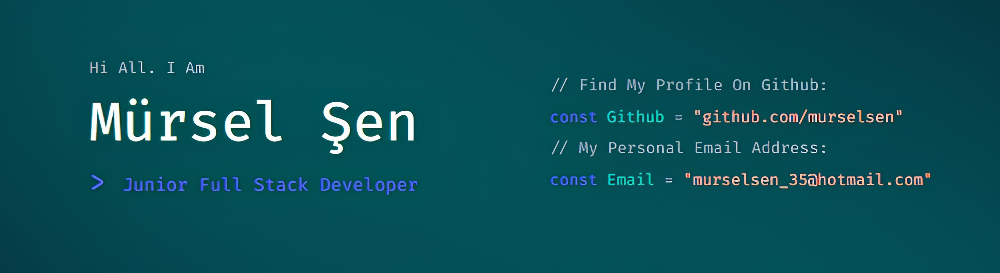

 

<h3 align="center">
  <strong>
 
  </strong>
    
  
  
  
   
  
</h3>
 
 
 

<h3 align="left">Techs</h3>

<table>
  <tr>
    <td align="center"></td>
    <td align="center"></td>
    <td align="center"></td>
    <td align="center"></td>
    <td align="center"></td>
    <td align="center"></td>
  </tr>
  <tr>
    <td align="center"></td>
    <td align="center"></td>
    <td align="center"></td>
    <td align="center"></td>
    <td align="center"></td>
    <td align="center"></td>
  </tr>
  <tr>
    <td align="center"></td>
    <td align="center"></td>
    <td align="center"></td>
    <td align="center"></td>
    <td align="center"></td>
    <td></td>
  </tr>
</table>

<h3 align="left">Social Media</h3>

<h3 align="left">Stats</h3>

  

 

